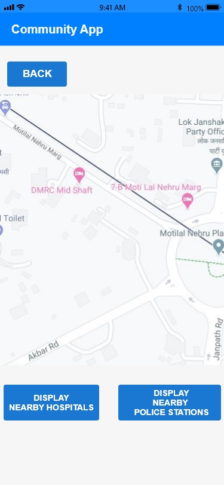

# Community-App
This Community App was designed under the MP Police Internship.
The Aim was to create an app capable of serving small buisnessmen, vegetable shop owners to upload any <b>crime related footage</b> from CCTV or IoT devices to a server.
The app also serves an SOS button capable of submitting the user's location to the server in case of any emergency.
Finally, this app can also display your location in the Map with additional features such as displaying nearby <b>hospitals</b> and <b>police-stations</b>

<b>NOTE: I have used Firebase as the cloud platform in this project.</b>  
The designs are created in Adobe XD: 
   

       
       
       
       
       
       
       
       

  <b><a href="https://www.freepik.com/free-photos-vectors/logo">Logo vector created by stock6design - www.freepik.com</a></b>

